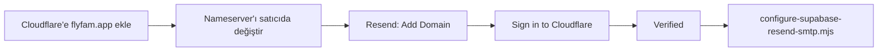

# flyfam.app — Cloudflare + Resend (FlyFam auth mail)

`flyfam.app` şu an **Cloudflare nameserver kullanmıyor** (kayıtlar `ui-dns.*` — genelde IONOS / domain satıcı DNS). Resend’in **“Sign in to Cloudflare”** otomatik kurulumu için önce domain’i Cloudflare’e taşımanız gerekir.

---

## flyfam.app zaten Cloudflare’deyse (sizin ekran)

DNS tablosunda **IONOS** kayıtları normal (`mx00.ionos.com`, kök SPF vb.) — bunlara **dokunmayın** (kurumsal mail kutunuz varsa).

Resend kayıtları **`send` alt alanına** gelir; kök `flyfam.app` MX/SPF ile çakışmaz.

### Seçenek 1 — Otomatik (önerilen)

1. [resend.com/domains](https://resend.com/domains) → `flyfam.app` ekleyin
2. **Sign in to Cloudflare** → `flyfam.app` seçin → izin verin
3. **Verify DNS Records**

Cloudflare DNS’te şunlar görünür (otomatik eklenir):

| Type | Name | Proxy |
|------|------|--------|
| MX | `send` | DNS only |
| TXT | `send` | DNS only |
| TXT | `resend._domainkey` | DNS only |

### Seçenek 2 — Elle (Add record)

Resend domain sayfasındaki tabloyu satır satır ekleyin:

1. **Add record** → **MX**  
   - Name: `send`  
   - Mail server: Resend’deki MX (ör. `feedback-smtp.us-east-1.amazonses.com`)  
   - Priority: `10`  
   - Proxy: kapalı (DNS only)

2. **Add record** → **TXT**  
   - Name: `send`  
   - Content: Resend SPF (`v=spf1 include:amazonses.com ~all` — sizinki farklı olabilir)

3. **Add record** → **TXT**  
   - Name: `resend._domainkey`  
   - Content: Resend’deki uzun `p=...` değeri

**Yapmayın:** Kök `flyfam.app` TXT SPF satırını Resend için değiştirmeyin; Resend `send.flyfam.app` kullanır. Kök SPF yalnızca IONOS içindir.

**Proxy:** `send` ve `resend._domainkey` satırları **gri bulut (DNS only)** — turuncu olmasın.

---

## Yol A — Domain henüz Cloudflare’de değilse

### 1) Cloudflare’e site ekle

1. [dash.cloudflare.com](https://dash.cloudflare.com) → giriş
2. **Add a site** → `flyfam.app` yaz → Continue
3. Plan: **Free** yeterli
4. Cloudflare mevcut DNS kayıtlarını tarar → **Continue**
5. Size **2 nameserver** verir, örneğin:
   - `ada.ns.cloudflare.com`
   - `bob.ns.cloudflare.com`  
   (Sizde farklı isimler olabilir — ekrandakileri kopyalayın.)

### 2) Nameserver’ları domain satıcınızda değiştirin

Domain’i nereden aldıysanız (IONOS, GoDaddy, Namecheap…):

1. Domain yönetimi → **Nameservers** / **DNS sunucuları**
2. Varsayılan `ui-dns.*` sunucularını kaldırın
3. Cloudflare’in verdiği **2 nameserver**’ı yapıştırın
4. Kaydedin

Yayılma **birkaç dakika – 48 saat** sürebilir. Cloudflare dashboard’da site **Active** olunca hazırsınız.

> Mevcut web sitesi / e-posta kutusu varsa: Cloudflare taramasında çıkan **A, CNAME, MX** kayıtlarını silmeyin; sadece nameserver değişir.

### 3) Resend + Cloudflare otomatik DNS

1. [resend.com/domains](https://resend.com/domains) → **Add Domain**
2. Domain: **`flyfam.app`**
3. **Receiving** kapalı (sadece gönderim)
4. Domain oluştuktan sonra → **Sign in to Cloudflare** (veya “Connect to Cloudflare”)
5. Cloudflare hesabınızı seçin → `flyfam.app` → **Authorize**
6. Resend MX / SPF / DKIM kayıtlarını **otomatik** ekler
7. **Verify DNS Records** → **Verified** (çoğu zaman 5–15 dk)

### 4) Cloudflare proxy (turuncu bulut)

Resend kayıtları genelde **DNS only (gri bulut)** olarak eklenir. Turuncu proxy açıksa mail doğrulaması bozulabilir → **DNS** sekmesinde `send` ve `resend._domainkey` satırlarında proxy **kapalı** olsun.

---

## Yol B — Cloudflare’e taşımadan (mevcut IONOS DNS)

Cloudflare kullanmak istemezseniz Resend’deki kayıtları **IONOS DNS panelinde** elle eklersiniz: [`RESEND_DNS_FLYFAM_APP_TR.md`](./RESEND_DNS_FLYFAM_APP_TR.md)

---

## Resend doğrulandıktan sonra (Supabase SMTP)

`.env` dosyanızda (zaten var):

```env
RESEND_API_KEY=re_...
SMTP_FROM_EMAIL=auth@flyfam.app
SMTP_SENDER_NAME=FlyFam
```

Supabase Management token ekleyin:

```env
SUPABASE_ACCESS_TOKEN=sbp_...
```

Sonra:

```bash
node scripts/configure-supabase-resend-smtp.mjs
```

Dashboard: [Authentication → SMTP](https://supabase.com/dashboard/project/slmgmcpluanezvkgkozw/auth/smtp)

---

## Kontrol

Cloudflare aktif mi?

```bash
dig NS flyfam.app +short
```

Çıktıda `cloudflare.com` geçmeli (henüz `ui-dns` görüyorsanız nameserver değişimi bitmemiş).

Resend kayıtları:

```bash
dig MX send.flyfam.app +short
dig TXT send.flyfam.app +short
dig TXT resend._domainkey.flyfam.app +short
```

---

## Özet akış


