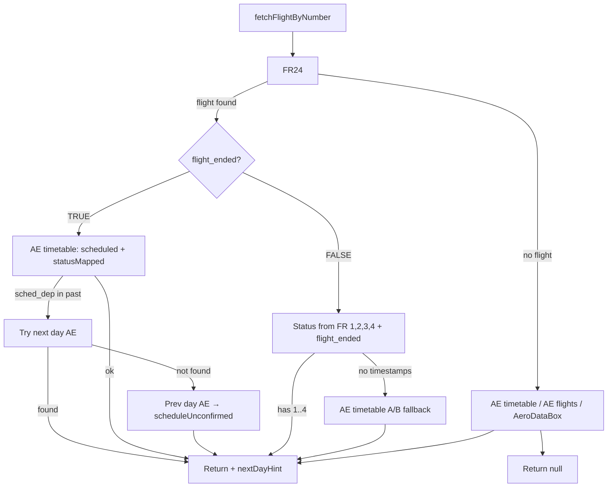

# Flight lookup & time handling (UTC-in, device-local display)

Bu doküman, FlyFam’de uçuş saatlerini **API’lerden UTC olarak alma**, DB’de **UTC olarak saklama** ve UI’da **kullanıcının cihaz/timezone’una göre** gösterme algoritmasını özetler.

## Temel kurallar

- **DB canonical**: `scheduled_*` ve `actual_*` alanları **UTC ISO** (sonu `Z` veya offset’li → normalize edilip `Z`’li ISO).
- **UI local**: Kullanıcıya gösterilen “Local” saat, **kullanıcının cihazının bulunduğu timezone**’dur (havaalanı timezone’u değil).
- **UTC varsayımı**:
  - **FR24**: FR24 dokümantasyonu UTC dediği için offset yoksa **UTC varsayılır**.
  - **Diğer API’ler**: Offset/Z yoksa **tahmin yapılmaz** (ambiguity → veri atlanır) veya kaynak özelinde local→UTC çevrimi yapılır (Aviation Edge Future gibi).

## UI’da saat gösterimi

- Roster’da gösterim:  
  - `Local`: `formatFlightTimeLocal(utcIso)` → cihaz timezone’unda HH:MM  
  - `UTC`: `formatFlightTimeUTC(utcIso)` → UTC HH:MM

> Not: “Local” artık kalkış/varış havaalanı yerel saati değil, **kullanıcının cihaz yerel saati**dir.

## Kullandığımız uçuş veri kaynakları (API’ler)

### 1) Aviation Edge — `timetable` (real-time schedules)
- **Amaç**: Bugün/canlı uçuşlar için scheduled + status + delay + (varsa) actual/estimated.
- **Endpoint**: `GET https://aviation-edge.com/v2/public/timetable`
- **Özellik**: API çağrısında tarih yok; response içinde `departure.scheduledTime` üzerinden **seçilen güne filtrelenir**.
- **Zamanlar**:
  - `scheduledTime` / `estimatedTime` bazen offset’li, bazen local olabilir.
  - Offset yoksa local→UTC için airport offset haritası kullanılır (mevcut MVP yaklaşımı).

### 2) Aviation Edge — `flightsFuture` (future schedules)
- **Amaç**: Seçilen tarih **todayLocal + 1 gün (yarın) ve sonrası** ise planlı (scheduled) saatleri bulmak.
- **Endpoint**: `GET https://aviation-edge.com/v2/public/flightsFuture`
- **Zamanlar**:
  - `scheduledTime` / `estimatedTime` çoğu zaman **local**. Local→UTC dönüşümü yapılır.

### 3) Aviation Edge — `flights` (live tracking)
- **Amaç**: Uçuş **canlı** iken tracking + status + (varsa) estimated/actual.
- **Endpoint**: `GET https://aviation-edge.com/v2/public/flights`
- **Filtre**: `flightIata=PC657` gibi (IATA flight no).
- **Zamanlar**:
  - Offset/Z varsa UTC’ye normalize edilir.
  - Offset yoksa, local→UTC dönüşümü için airport offset MVP yaklaşımı kullanılır.

### 4) Flightradar24 — `flight-summary/light`
- **Amaç**: Geniş zaman penceresinde doğru uçuşu bulmak; scheduled ve (varsa) actual.
- **Endpoint**: `GET https://fr24api.flightradar24.com/api/flight-summary/light`
- **Zamanlar**:
  - FR24 “UTC” dediği için offset yoksa **UTC varsayılır** (normalize edilip `Z`’li ISO’a çevrilir).
- **Filtre**:
  - Seçilen gün için `scheduled_departure_utc`/fallback alanlarının `YYYY-MM-DD` kısmı eşleşen kayıt seçilir.

### 5) AeroDataBox (RapidAPI)
- **Amaç**: Status + scheduled/actual/estimated; özellikle `...TimeUtc` alanları ile net UTC.
- **Endpoint**: `GET https://{host}/flights/number/{flightNumber}/{date}`
- **Zamanlar**:
  - Öncelik `scheduledTimeUtc` / `actualTimeUtc`.
  - Offset/Z içermeyen datetime’ler **kabul edilmez** (tahmin yok).

### (Opsiyonel/implement edildi) 5) AviationStack
- **Amaç**: Alternatif schedule kaynağı.
- **Endpoint**: `GET https://api.aviationstack.com/v1/flights`
- **Not**: Kodda parser mevcut; lookup zincirine dahil edilmesi gerekiyorsa ayrı karar.

## Lookup akışı (FR24 öncelikli)

`fetchFlightByNumber(flightNumber, date)` önce FR24’e bakar; **flight_ended** değerine göre dallanır.

### 1) FR24 `flight_ended === TRUE`

- **Kaynak:** Aviation Edge **timetable** (scheduled + **statusMapped**).
- Scheduled times AE timetable’dan alınır, listeye öyle konur.
- **scheduled_departure** şu anki zamandan gerideyse (geçmişteyse):
  - Önce **yarın** (next day) tarihli AE timetable sorgusu yapılır; bulunursa o uçuşun saatleri + statusMapped kullanılır (nextDayHint).
  - Yarında yoksa **önceki gün** verisi alınır, **“to be updated”** (scheduleUnconfirmed) işaretlenir.
- Status: **AE timetable → statusMapped**.

### 2) FR24 `flight_ended === FALSE`

- **Kaynak:** FR24; status **sadece** aşağıdaki 4 zaman + `flight_ended` ile türetilir (actual zamanlar/GS/ALT kullanılmaz).
- FR24’ten gelen zamanlar (UTC):
  - **1** = first_seen  
  - **2** = datetime_takeoff  
  - **3** = datetime_landed  
  - **4** = last_seen  

Kullanıcının kontrol ettiği andaki **UTC** saati (now) ile:

| Koşul | Status |
|-------|--------|
| now **< 1** | Scheduled |
| now **≥ 1** ve (2 null veya now 1–2 arası) | Taxi-Out |
| now **≥ 2** ve (3 null veya now 2–3 arası) | En-Route |
| now **≥ 3** | Landed |
| now **≥ 4** ve **flight_ended === false** | Parked |

### 3) FR path’te aksilik (fallback)

FR24’e geçildi ama status türetilemiyorsa (ör. 1–4 zamanları yok):

- **Kaynak:** AE timetable’daki **actual_departure (A)** ve **actual_arrival (B)**.
- now < A ve B null → **Scheduled**
- now ≥ A ve B null → **En-Route**
- now ≥ B → **Landed**

### 4) FR24’te uçuş yok

- Sırayla: AE timetable (full status) → AE flights (live) → (yarınsa) AE future → FR24 tekrar → AeroDataBox.
- Bulunan ilk kaynaktan `FlightInfo` (scheduled + status) döner.

## Mermaid şema

## Neden bazı uçuşlar "—" (dash) görünür?

Listede kalkış/varış saatleri **"—"** ise, o uçuş için **hiçbir kaynak** `scheduled_departure` / `scheduled_arrival` döndürmedi demektir. Olası nedenler:

1. **FR24** uçuşu buldu ama API yanıtında `scheduled_departure_utc` / `scheduled_arrival_utc` yok (bazı uçuşlarda FR24 plan saatini göndermiyor). Bu durumda aynı tarih için **Aviation Edge timetable** ile doldurulmaya çalışılır; AE’de de yoksa saatler boş kalır.
2. **Aviation Edge timetable** sadece belirli **hub** havaalanlarından sorgulanıyor (Pegasus için: IST, SAW, ADB, AYT, ESB). Uçuş bu hub’lardan birinden o tarihte dönmüyorsa veya AE’de o gün için kayıt yoksa eşleşme olmaz.
3. **Tarih eşleşmesi**: AE timetable’da “seçilen gün” = kalkış havaalanı yerel tarihi. Tarih formatı veya timezone farkı yüzünden eşleşme kaçabiliyor.
4. **Hiçbir API uçuşu bulamadı**: FR24, AE timetable, AE live, AE future, AeroDataBox hepsi null dönerse liste satırı route/numara ile kalır ama saatler boş (dash).

**Ne yapılır?** Dash uçuşlar için uygulama **saatte bir** otomatik yeniden API çağrısı yapar; bir kaynak sonradan saat döndürürse liste güncellenir. İstersen manuel "Sync" de deneyebilirsin. Belirli bir uçuş (örn. PC2550) için konsolda `[FlightAPI PC2550]` ve `[Debug PC2550]` loglarına bakarak hangi kaynağın ne döndürdüğünü görebilirsin.

## Bilinen riskler / iyileştirme notları

- **DST (yaz saati)**: Aviation Edge local→UTC dönüşümü airport “sabit offset” tablosuyla yapılıyor; DST olan ülkelerde hataya açık. En sağlam çözüm:
  - API’den UTC/offset’li alanı tercih etmek veya
  - Airport → IANA timezone ile dönüşüm (örn. `Europe/London`) ve timezone-aware bir kütüphane kullanmak.

