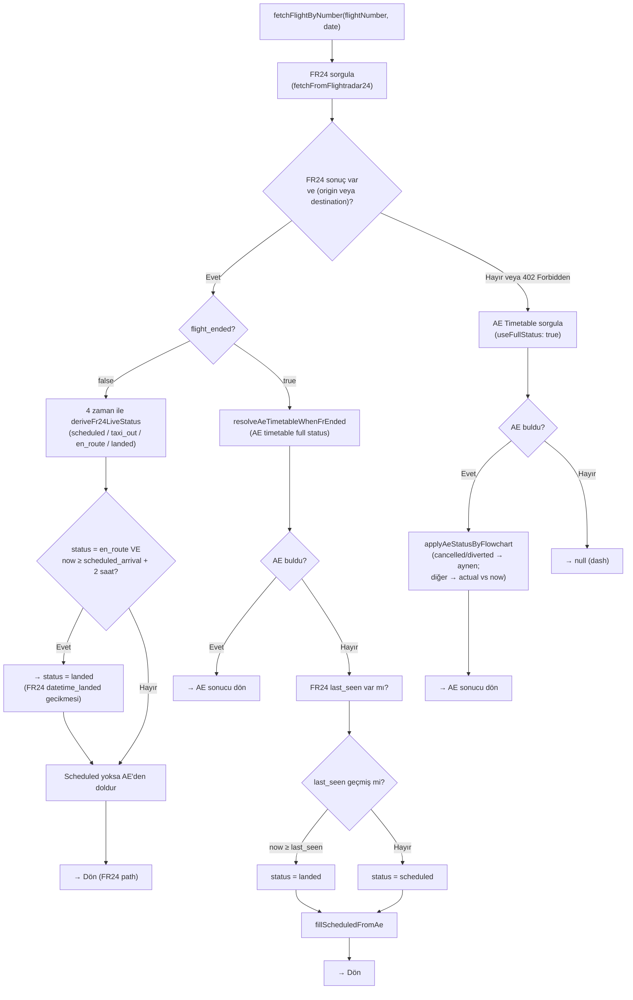
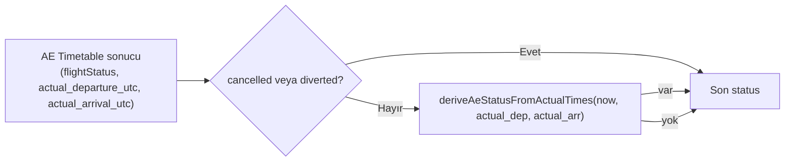
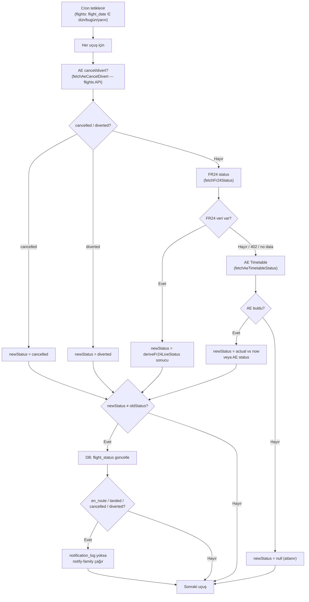
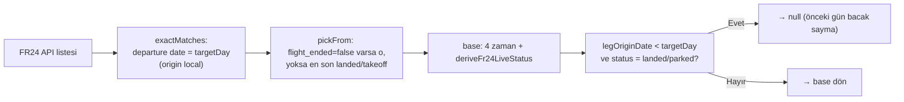

# Uçuş durumu (status) algoritması — son hal (Mermaid)

Statü belirleme algoritmasının güncel hali. VS Code (Mermaid eklentisi), GitHub veya [mermaid.live](https://mermaid.live) ile görüntüleyebilirsin.

---

## 1. Ana akış: Uygulama (fetchFlightByNumber)

Crew uygulaması uçuş eklerken veya güncellerken kullanılır. Önce FR24; FR24 yoksa veya hata (402 vb.) ise AE timetable.



**Not:** FR24 402 veya veri dönmezse FR24 yokmuş gibi devam edilir → AE Timetable. Cron (check-flight-status-and-notify) da aynı mantıkla FR24 sonrası 402/veri yoksa AE timetable’dan statü alır; aile 402’de de bildirim alabilir.

---

## 2. FR24 durum türetme: deriveFr24LiveStatus

FR24’ten gelen 4 zaman (UTC) ile **now** karşılaştırılır. Sıra önemli.

| # | Alan | Anlamı |
|---|------|--------|
| 1 | first_seen | İlk görülme |
| 2 | datetime_takeoff | Kalkış |
| 3 | datetime_landed | İniş |
| 4 | last_seen | Son görülme |

```mermaid
flowchart TB
  NOW("now (UTC ms)")
  T1["first_seen"]
  T2["datetime_takeoff"]
  T3["datetime_landed"]
  T4["last_seen"]

  NOW --> C1{now < first_seen?}
  C1 -->|Evet| S1["scheduled"]
  C1 -->|Hayır| C2{first var ve\n(takeoff yok veya now < takeoff)?}
  C2 -->|Evet| S2["taxi_out"]
  C2 -->|Hayır| C3{takeoff var ve\n(landed yok veya now < landed)?}
  C3 -->|Evet| S3["en_route"]
  C3 -->|Hayır| C4{now ≥ last_seen?}
  C4 -->|Evet| S4["landed"]
  C4 -->|Hayır| C5{now ≥ datetime_landed?}
  C5 -->|Evet| S5["landed"]
  C5 -->|Hayır| S6["taxi_out"]
```

**Kural özeti:**

| Koşul | Status |
|-------|--------|
| now < first_seen | **scheduled** |
| first_seen ≤ now < datetime_takeoff (veya takeoff yok) | **taxi_out** |
| datetime_takeoff ≤ now < datetime_landed (veya landed yok) | **en_route** |
| now ≥ last_seen veya now ≥ datetime_landed | **landed** |
| Aksi (first var, takeoff geçmiş, landed/last yok) | **taxi_out** |

---

## 3. AE (Aviation Edge) statü: applyAeStatusByFlowchart

FR24 yokken veya flight_ended=true iken AE timetable kullanılır.



**deriveAeStatusFromActualTimes (actual vs now):**

| Koşul | Status |
|-------|--------|
| now < actual_departure | **scheduled** |
| actual_departure ≤ now < actual_arrival | **en_route** |
| now ≥ actual_arrival | **landed** |

---

## 4. Cron: check-flight-status-and-notify

Cron her 2–3 dakikada çalışır; sadece **flight_status** güncellenir, actual_* yazılmaz. Aile bildirimi sadece status **değiştiğinde** (en_route, landed, cancelled, diverted).



**Cron’da kullanılan statü kaynakları (manuel ile aynı sıra):**

1. **AE cancel/divert** (flights API) → cancelled / diverted
2. **FR24** (flight-summary/light) → deriveFr24LiveStatus → scheduled / taxi_out / en_route / landed
3. **FR24 402 veya veri yok** → **AE timetable** (fetchAeTimetableStatus) → actual vs now veya AE status; aile 402’de de bildirim alır.

---

## 5. FR24 bacak seçimi (pickBest) ve “önceki gün landed” kuralı



---

## 6. UI etiketleri (Türkçe)

| flight_status (DB) | Roster etiketi |
|--------------------|----------------|
| scheduled | Planlı |
| taxi_out | Taksi |
| departed | Ayrıldı |
| en_route | Kalktı |
| landed | İndi |
| parked | İndi |
| cancelled | İptal |
| diverted | Aktarma |

---

## 7. Özet tablo (kaynak → status)

| Bağlam | Kaynak | Status nasıl? |
|--------|--------|----------------|
| Uygulama, FR24 var, flight_ended=false | FR24 4 zaman | deriveFr24LiveStatus; en_route iken now ≥ sched_arr+2h → landed |
| Uygulama, FR24 var, flight_ended=true | AE timetable veya FR24 last_seen | AE varsa AE; yoksa last_seen ≥ now → landed, değilse scheduled |
| Uygulama, FR24 yok | AE timetable | applyAeStatusByFlowchart (cancelled/diverted veya actual vs now) |
| Cron | AE cancel/divert → FR24 | Önce AE flights (cancel/divert); değilse FR24; FR24 yoksa şu an atlanır (AE timetable fallback eklenebilir) |
